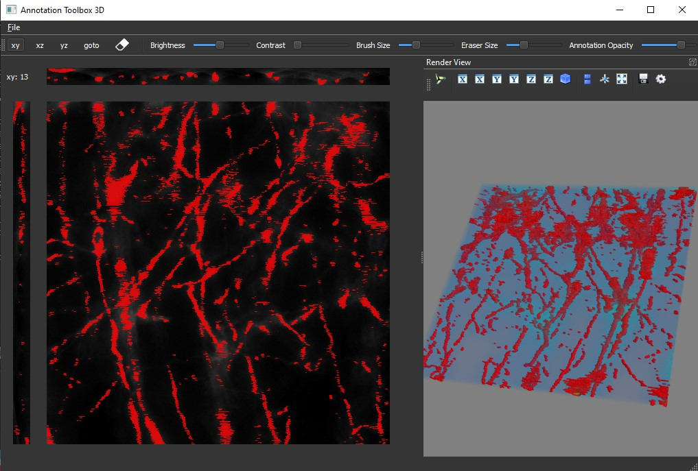

# 3D Annotation Tool for TIFF volumes

Interactive annotation tool for 3D TIFF volumes with integrated UNET semantic segmentation and active learning for semi-automated and automated binary annotations along with embedded live volume rendering. The tool offers planar views into all cross-sections and establishes correspondences between them while storing a 3D representation of the binary annotation voxel grid.


## Dependencies:
Install all required dependencies by:
```!bash
pip install -r requirements.txt
```

## Run:
```!bash
python main.py
```

# Future prospects and development:
- Active deep learning for semi-automated/automated annotation with integrated Keras/TF training utilization for GPU-powered desktops. (WIP)
- UNET diverse modified segmentation models and other auto-encoder alternatives as well as dynamic model specifications.
- Data augmentation setup and adjustments using elastic deformations.
- Export of the minimal annotation features to Android/iOS with access to a render/training server.
- Improved and smarter real-time volume rendering using a VTK pipeline.
- Graphics Tablet for Desktop & Natural User Interface (NUI) for interactions on Mobile/Tablet devices and usability.
- CUDA core processing for numpy via CuPy or OpenCUDA integration.
- Registration of 3D segmented datasets and annotations.
- Session tracking, autosave, more utility features and multi-class segmentation.


## History:
### V0.2 Kivy GUI
Shifted to Kivy for a cross-platform (Desktop/Mobile) and responsive GUI experience with pure python libraries for export via python-for-android and utilization of OpenGL.


### V0.1 Tkinter GUI
Implemented with Tkinter initially with popups for maximizing plane views and restricted window sizes along with the first functions.

